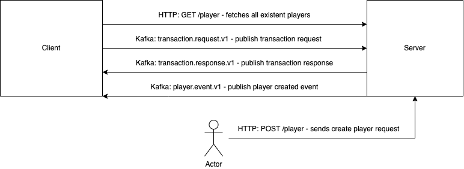

# Task

Implement client and server in Java.

## Description

Server offers service for player wallet (balance). Wallet state (balance) should be managed in memory (3rd party solution may not be used). Balance is backed up in database (run some database you like in docker). When balance is not in memory, it is loaded from database and any changes are done in memory.

Player record in database is created on demand. There is a periodical background process to write changes from memory to database.

### Constraints on balance changes

- Balance cannot be less than 0.
- If transaction exists (is duplicate), then previous response is returned. Check may take into
consideration only 1000 latest transactions.
- If balance change is bigger than configured limit, then change is denied (explained further
below).
- If player is in blacklist, then change is denied (explained further below).

Configuration (balance change limit and player blacklist) must be taken from external source. This can be file, database, external component etc.

Client itself is a server that offers gameplay logic. Specific gameplay will not be implemented, client can just generate random balance updates. Specific communication protocol between client and server is not specified (custom protocol can be invented). Server must write proper log information, where at least IN/OUT per player must be grep’able.

### Commands between servers

client -> server: username, transaction id, balance change 

server -> client: transaction id, error code, balance version, balance change, balance after change 

### Database structure

PLAYER(USERNAME, BALANCE_VERSION, BALANCE)

### Documentation

- Describe shortly the implementation aspects.
- If some features are not implemented, point out the reasons

### Building and Packaging

- The solution can be built using any commonly available build framework (e.g. Maven, Gradle, Ant). Providing project-local wrappers for running the build in-place are appreciated.
- As a part of the build, the solution should be packaged into Docker containers. Do not publish the solution to a public Docker repository; providing Dockerfiles and docker-compose or instructions on how to build and run the containerized solution should be enough.
- Preferred solution is without Spring

# QA

### Questions

1. Database structure: is it assumed it consists only with one table Player(username, balance_version, balance) and other things like transaction history should be persisted in memory?
2. What is the criteria of uniqueness of transaction (check duplicates part)? Is transaction id enough or it should be a combination of transaction fields?
3. Balance is backed up in the database: should it be done after each successful transaction - update balance and balance version in table Player or this is the task for periodic background process which writes changes from memory to database?

### Answers

1. Persisting in the database would be better.
2. Transaction id is enough.
3. Background process

# Implementation Aspects

### Technology stack

- Java 17
- Postgres
- Kafka

### Implementation description

The following diagram shows how components communicate each other:



Client fetches all existing players from server by http request on startup. Then it creates worker for each player that generate and publish transaction request to `transaction.request.v1` kafka topic in your own thread. Server consumes such requests, creates transaction and applies to corresponding wallet if it is possible. Then server generate transaction response and publish it to `transaction.response.v1` kafka topic.

User can send http request to Server to create new player. When Server receives such request it creates new record in table `Player` and publishes `Player created event` to `player.event.v1` kafka topic. Here is example of new player request
```
POST localhost:8080/player

Content-Type: application/json
{
  "username": "сatwoman"
}

```
Client consumes events from `player.event.v1` topic and creates worker to start generating transaction request in separate thread.

# How to run

### In Docker

```docker-compose up```

### Locally

Client and Server applications must be launched with Java 17. From project root directory run the following commands in the same order:

1. ```docker-compose -f docker-compose.local.yaml up -d```
2. ```mvnw clean install```
3. ``` java -jar server/target/app-jar-with-dependencies.jar```
4. ```java -jar client/target/app-jar-with-dependencies.jar ```

